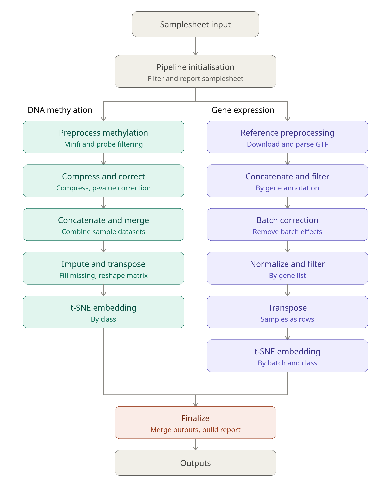

<h1>
  <picture>
    
  </picture>
</h1>

## Introduction

**mlomix** is a bioinformatics that accepts gene expression feature counts and/or DNA methylation data (beta matrices or raw IDAT files) together with the corresponding classes for each sample, and processes the data for machine learning classification for e.g. cancers.

It comes bundled with configs for pre-processing inference data for classification using PALLAS10k (Pan Acute Leukemia Learning and Subtyping), a multi-modal classifier used to predict subtypes of pediatric acute lymphoblastic leukemia (ALL) and acute myeloid leukemia (AML).

<picture>
  
</picture>

## Usage

### Input samplesheet

First, prepare a samplesheet with your input data that looks as follows:

`samplesheet.csv`:

```csv
sample,dataset,gex_feature_counts_file
CONTROL_REP1,201009_A00123_0045_AHT2LMDSXX,/path/to/CONTROL_REP1.txt
```

Full documentation on the samplesheet columns is [here](docs/samplesheet.md).

### Running the pipeline


> If you are new to Nextflow and nf-core, please refer to [this page](https://nf-co.re/docs/usage/installation) on how to set-up Nextflow. Make sure to [test your setup](https://nf-co.re/docs/usage/introduction#how-to-run-a-pipeline) with `-profile test` before running the workflow on actual data.


Now, you can run the pipeline using:

<!-- TODO nf-core: update the following command to include all required parameters for a minimal example -->

```bash
nextflow run mlomix \
   -profile <local/docker/singularity/.../institute> \
   --input samplesheet.csv \
   --outdir <OUTDIR>
```

To pre-process data for inference using the PALLAS classifier, run:

```bash
nextflow run mlomix \
   -profile <local/docker/singularity/.../institute> \
   --input samplesheet.csv \
   --outdir <OUTDIR> \
   --classifier_name pallas \
   --classifier_version 1.0.0
```

<!--
> Please provide pipeline parameters via the CLI or Nextflow `-params-file` option. Custom config files including those provided by the `-c` Nextflow option can be used to provide any configuration _**except for parameters**_; see [docs](https://nf-co.re/docs/usage/getting_started/configuration#custom-configuration-files).

For more details and further functionality, please refer to the [usage documentation](https://nf-co.re/mlomix/usage) and the [parameter documentation](https://nf-co.re/mlomix/parameters).

## Pipeline output

To see the results of an example test run with a full size dataset refer to the [results](https://nf-co.re/mlomix/results) tab on the nf-core website pipeline page.
For more details about the output files and reports, please refer to the
[output documentation](https://nf-co.re/mlomix/output).
-->


<!--
## Credits

nf-core/mlomix was originally written by Mariya Lysenkova Wiklander.

We thank the following people for their extensive assistance in the development of this pipeline:

<!-- TODO nf-core: If applicable, make list of people who have also contributed -->


## Citations

<!-- TODO nf-core: Add citation for pipeline after first release. Uncomment lines below and update Zenodo doi and badge at the top of this file. -->
<!-- If you use nf-core/mlomix for your analysis, please cite it using the following doi: [10.5281/zenodo.XXXXXX](https://doi.org/10.5281/zenodo.XXXXXX) -->

<!-- TODO nf-core: Add bibliography of tools and data used in your pipeline -->

This pipeline uses code and infrastructure developed and maintained by the [nf-core](https://nf-co.re) initative, and reused here under the [MIT license](https://github.com/nf-core/tools/blob/master/LICENSE).

> The nf-core framework for community-curated bioinformatics pipelines.
>
> Philip Ewels, Alexander Peltzer, Sven Fillinger, Harshil Patel, Johannes Alneberg, Andreas Wilm, Maxime Ulysse Garcia, Paolo Di Tommaso & Sven Nahnsen.
>
> Nat Biotechnol. 2020 Feb 13. doi: 10.1038/s41587-020-0439-x.

In addition, references of tools and data used in this pipeline are as follows:
